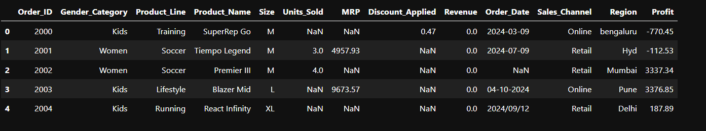
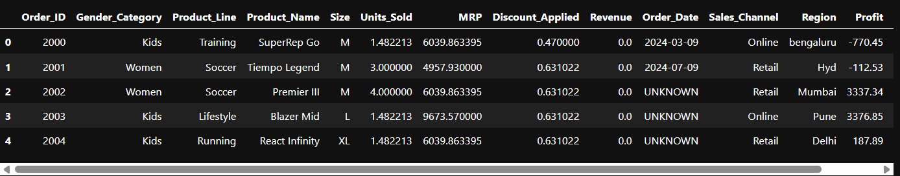

# 🧹 Nike Sales Data Cleaning Project

### 📌 Overview
This project focuses on cleaning and preprocessing Nike sales data to prepare it for analysis or machine learning.

### 🎯 Objectives
- Handle missing values
- Fix inconsistent date formats
- Clean and standardize numeric and categorical variables
- Export a clean and usable dataset

---

### 📂 Dataset

| Type | File |
|------|------|
| Raw Data | `data/Nike_Sales_Uncleaned.csv` |
| Cleaned Data | `data/Cleaned_data.csv` |

---

### 🔧 Tools Used
- Python (Pandas)

---

### 🔍 Before Cleaning

---

### 🧹 After Cleaning

---

### 📁 Repository Structure

Nike_Sales_Uncleaned_data-cleaning/
│
├── data/
│ ├── Nike_Sales_Uncleaned.csv
│ └── Cleaned_data.csv
│
├── notebooks/
│ └── Project_1.ipynb
│
├── images/
│ ├── before_cleaning.png
│ └── after_cleaning.png
│
└── reports/
└── Project_1.pdf

---

### 📌 Result

✔ Missing values handled  
✔ Inconsistent formats fixed  
✔ Exported ready-to-use cleaned dataset  

---

### 🚀 Next Steps (Optional)
- Exploratory data analysis
- Build predictive models on cleaned dataset
- Dashboard visualization

